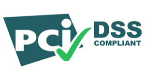
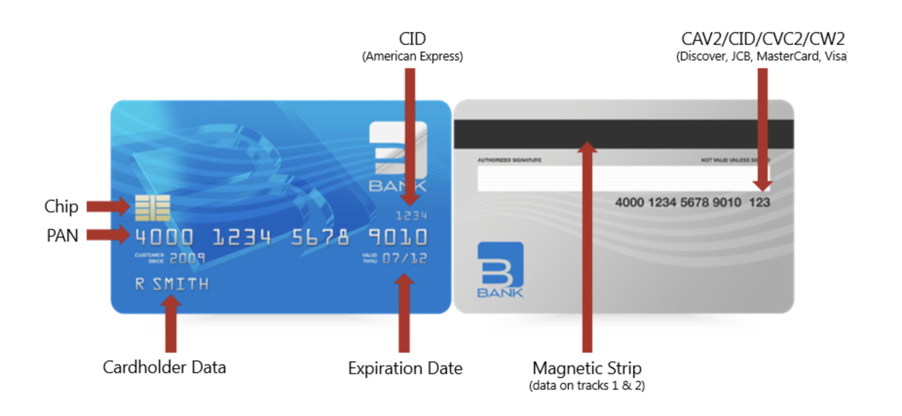
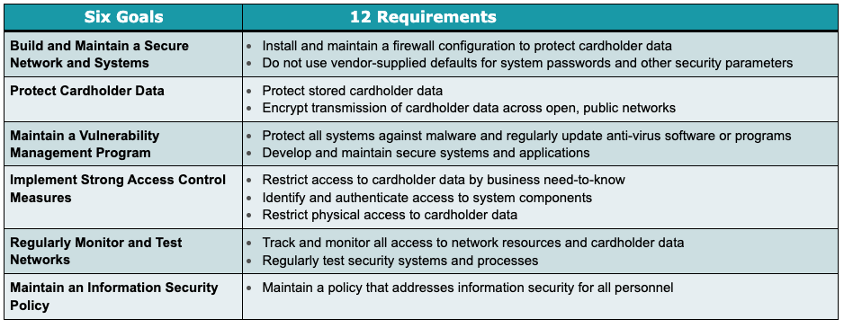
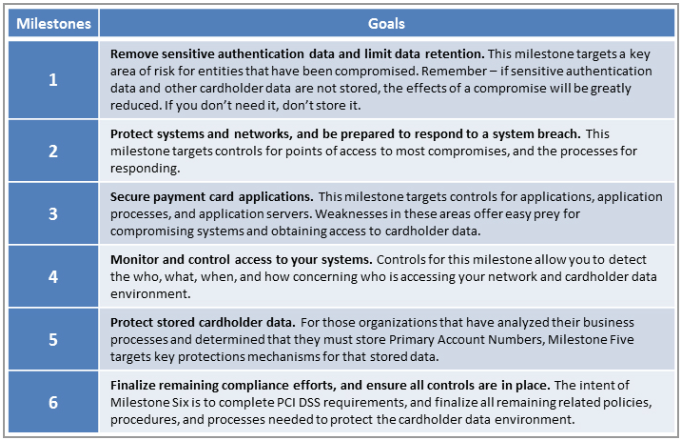

# PCI-Fundamentals
My notes for PCI DSS 3.2 training (July 2023)  
_Please do not take this as an authoritative source for PCI DSS, these are just my notes._

Link to the PCI 3.2.1 Quick Reference Guide: [https://www.pcisecuritystandards.org/pdfs/pci_ssc_quick_guide.pdf](https://www.pcisecuritystandards.org/pdfs/pci_ssc_quick_guide.pdf)

## Section 1 - Background
Payment cards are consistently one of the most highly stolen types of data. This theft is commonly done with credit card skimming devices, exploitation of outdated software, malware, or stolen credentials. According to the Verizon Data Breach Investigations Report of 2017, “95% of breaches featuring the use of stolen credentials leveraged vendor remote access to hack into their customer’s POS [point-of-sales] environments".  

Merchants that rely on credit card transactions are the primary targets of malicious actors looking for payment card data. It is the responsibility for merchants/organizations to have secure environments and prevent data theft.  

The Payment Card Industry Data Security Standard (PCI DSS) exists to help merchants prevent the theft of payment card data. It is a widely accepted set of policies and procedures intended to optimize the security of credit, debit, and cash card transactions and protect cardholders against misuse of their personal information.  

The body that provides oversight for PCI DSS is the PCI Security Standards Council. The council includes representatives from the 5 major payment card brands: Visa, American Express, MasterCard, Discover, and JCB. These card brands require PCI DSS compliance for merchants to use their payment card neworks.  

These are some resources that are provided by the council:
- PCI DSS, PA-DSS, P2PE, PTS, and Card Protection standards
- Rosters of QSAs, PA-QSAs, PCIPs, ASVs, validated payment applications, PTS Devices, and P2PE solutions
- Education programs
- Community meetings and FAQs  

Here are explanations for some of those standards listed above:  
### PCI DSS  
This covers security of all environments that store, process, or transmit account data. Its scope covers account data stored in payment applications and other sources.  

### PA-DSS  
This covers third-party payment applications to support PCI DSS compliance. This applies to things like POS devices, shopping carts in a web app, etc.. This standard covers how to validate off-the-shelf applications used in authorization and settlement. PA-DSS governs how these apps work so they can be compliant with PCI-DSS.  

### PCI P2PE  
This covers encryption, decryption, and key management requirements for point-to-point encryption solutions. It specifies requirements that must be in place from the POI (the Point Of Interaction, like when a card is swiped through the card reader) to the service provider's secure decryption environment. The council has a list of pre-approved P2PE solutions. Merchants may be able to reduce their PCI DSS scope when using a pre-approved solution.  

### PCI PTS  
This covers the protection of sensitive data at POI devices and hardware security modules, like cash registers, ATMs, fuel pumps/kiosks. The PTS program ensures terminals cannot be manipulated or attacked to allow the capture of Sensitive Authentication data, nor allow access to clear-text PINs or keys.  

### Card Production  
This covers the physical and logical security requirements for entities involved in card production and provisioning, which may include manufacturers, personalizers, pre-personalizers, chip embedders, data-preparation, and fulfillment.  

Here is an explanation of all the different entities involved in the payment card ecosystem:  

_**Issuer**_ banks give payment cards to **_Cardholders_**, who then make purchases from _**Merchants**_. The _**Merchants**_ then send the payment card data to their _**Acquirer**_ bank. The _**Acquirer**_ bank sends the payment card and transaction data over the _**Payment Brand Network**_ to the _**Issuer**_ bank. The _**Issuer**_ bank tells the _**Acquirer**_ bank that it approves or denies the transaction.

The Acquirer may also be referred to as the "Merchant Bank", "ISO", or "Payment Brand". Visa and MasterCard do not issue cards directly—their cards are always issued through another bank or entity—so they are never referred to as the Issuer.

During a process called **clearing** the processor provides complete reconcilation to the merchant's bank.
During a process called **settlement** the merchant bank pays the merchant for the carhdolder peurchase, and the cardholder's bank bills the cardholder.

A _**Service Provider**_ (SP) is a business that is not a payment brand, but controls or impacts the security of another entity's cardholder data. Some examples include transaction processors, Independent Sales Organizations (ISOs), managed firewall providers, IDS service providers, or hosting providers. SPs usually undergo their own PCI DSS assessments to demonstrate their compliance to their customers. Alternatively, a SP could have their services reviewed as part of their customers' PCI DSS assessments. _Note: Entities that only provide public network access, like a telecom company, are not considered SPs._ 

## Section 2 - Payment Card Brands and Their Compliance Programs  
Each of the 5 founding payment brands has their own PCI DSS compliance programs.
- American Express: [Data Security Operating Policy (DSOP)](https://www.americanexpress.com/content/dam/amex/us/merchant/new-data-security/DSOP_Oct2020_US_EN.pdf)
- Discover: [Discover Information Security Compliance (DISC)](https://www.discoverglobalnetwork.com/solutions/pci-compliance/discover-information-security-compliance/)
- JCB: [Data Security Program](https://www.global.jcb/en/products/security/data-security-program/index.html)
- MasterCard: [Site Data Protection (SDP)](https://www.mastercard.us/en-us/business/overview/safety-and-security/security-recommendations/site-data-protection-PCI.html)
- Visa Inc: [Cardholder Information Security Program (CISP)](https://usa.visa.com/partner-with-us/pci-dss-compliance-information.html)
- Visa Europe: [Account Information Security (AIS) Program](https://bm.visa.com/run-your-business/small-business/information-security/ais-program.html)
Payment brand compliance programs handle compliance tracking, enforcement, and any fees that may be incurred by noncompliance. Approval and posting of compliant entities and forensic investigation and response to data breaches are other responsibilities of the payment brands. It is important to note that the PCI SSC does not do investigations or response—this is all handled by the brands.

## Section 3 - Merchant Levels  

Every payment brand has different definitions for different *merchant levels*. Merchant levels range from 1-4 and are determined by the Acquirer based on annual number of transactions.

This is how merchant levels are defined by each payment brand _except for Visa_:

| Level | American Express                                                                                                                                  | Discover                                                                                                                                                                                                                      | JCB                                                                                     | MasterCard                                                                                                                                                                                                                                                                   |
| ----- | ------------------------------------------------------------------------------------------------------------------------------------------------- | ----------------------------------------------------------------------------------------------------------------------------------------------------------------------------------------------------------------------------- | --------------------------------------------------------------------------------------- | ---------------------------------------------------------------------------------------------------------------------------------------------------------------------------------------------------------------------------------------------------------------------------- |
| 1     | Merchants processing over 2.5 million American Express card transactions annually or any merchant that American Express otherwise deems a Level 1 | Merchants processing over 6 million card transactions annually on the Discover network Any merchant Discover determines to be a Level 1 Merchants required by another payment brand to validate and report as a Level 1 | Merchants processing over 1 million JCB transactions annually, or compromised merchants | Merchants processing over 6 million total combined MasterCard and Maestro transactions annually Merchants that have experienced an account data compromise Any merchant that MasterCard otherwise deems a Level 1 Any merchant meeting the Level 1 criteria of Visa |
| 2     | Merchants processing 50,000 to 2.5 million American Express transactions annually                                                                 | Merchants processing 1 million to 6 million card transactions annually on the Discover network Merchants required by another payment brand to validate and report as a Level 2 merchant                                    | Merchants processing less than 1 million JCB transactions annually                      | Merchants with greater than 1 million but less than or equal to 6 million total combined MasterCard and Maestro transactions annually Any merchant meeting the Level 2 criteria of Visa                                                                                   |
| 3     | Merchants processing less than 50,000 American Express transactions annually                                                                      | Merchants processing 20,000 to 1 million card-not-present only transactions annually on the Discover network Merchants required by another payment brand to validate and report as a Level 3 merchant                      | N/A                                                                                     | Merchants with greater than 20,000 combined MasterCard and Maestro e-commerce transactions annually but less than or equal to one million total combined MasterCard and Maestro ecommerce transactions annually Any merchant meeting the Level 3 criteria of Visa         |
| 4     | N/A                                                                                                                                               | All other Discover Network Merchants                                                                                                                                                                                          | N/A                                                                                     | All other MasterCard merchants                                                                                                                                                                                                                                               |                                                                              |                                                                            |

This is how Visa defines merchant levels:

| Level | Visa Inc.                                                                                                                                                  | Visa Europe                                                                                                                                                |
| ----- | ---------------------------------------------------------------------------------------------------------------------------------------------------------- | ---------------------------------------------------------------------------------------------------------------------------------------------------------- |
| 1     | Merchants processing over 6 million Visa transactions annually (all channels), or global merchants identified as Level 1 by any Visa region                | Merchants processing over 6 million Visa transactions annually (all channels), compromised entities may be escalated to Level 1 at regional discretion     |
| 2     | Merchants processing 1 million to 6 million Visa transactions annually (all channels)                                                                      | Merchants processing 1 million to 6 million (all channels) Visa transactions annually                                                                      |
| 3     | Merchants processing 20,000 to 1 million Visa e-commerce transactions annually                                                                             | Merchants processing 20,000 to 1 million Visa e-commerce transactions annually                                                                             |
| 4     | Merchants processing less than 20,000 Visa e-commerce transactions annually, and all other merchants processing up to 1 million Visa transactions annually | Merchants processing less than 20,000 Visa e-commerce transactions annually, and all other merchants processing up to 1 million Visa transactions annually |

## Section 3 - Merchant Validation Requirements

Here is an overview of what the different merchant levels usually entail.

|Merchants               | Level 1          | Level 2       | Levels 3 & 4                  |
|------------------------|:----------------:|:-------------:|:-----------------------------:|
| Assessment Type:       | Onsite Assessment|Self assessment|Determined by brand or acquirer|
| Reporting Requirements:| ROC & ASV scan   |SAQ & ASV scan |Determined by brand or acquirer|

|Service Providers       | Level 1          | Level 2       | Levels 3 & 4  |
|------------------------|:----------------:|:-------------:|:-------------:|
| Assessment Type:       | Onsite Assessment|Self assessment|Self assessment|
| Reporting Requirements:| ROC & ASV scan   |SAQ & ASV scan |SAQ & ASV scan |

Specific merchant validation requirements for each payment card brand:

| Level | American Express                                                                                                                                                                                                                             | Discover                                                                                                                                                                                                                                                  | JCB                                                                        | MasterCard                                                                                                                                                                                                                                                                                                                                                                                                                                                                                      | Visa                                                                                                                                                                                                                                                                                                                                                                                        |
| ----- | -------------------------------------------------------------------------------------------------------------------------------------------------------------------------------------------------------------------------------------------- | --------------------------------------------------------------------------------------------------------------------------------------------------------------------------------------------------------------------------------------------------------- | -------------------------------------------------------------------------- | ----------------------------------------------------------------------------------------------------------------------------------------------------------------------------------------------------------------------------------------------------------------------------------------------------------------------------------------------------------------------------------------------------------------------------------------------------------------------------------------------- | ------------------------------------------------------------------------------------------------------------------------------------------------------------------------------------------------------------------------------------------------------------------------------------------------------------------------------------------------------------------------------------------- |
| 1     | Annual Onsite Assessment performed by QSA or merchant if certified by the chief executive officer, chief financial officer, chief information security officer, or principal of the merchant Quarterly network scan by ASV                | Annual onsite assessment by QSA or merchant's Internal Auditor Quarterly network scan by ASV                                                                                                                                                           | Annual onsite assessment by QSA Quarterly network scan by ASV           | Annual onsite assessment by QSA [Level 1 merchants that choose to conduct an annual onsite assessment using an internal auditor (or other defined independent staff) must ensure that primary internal staff engaged in validating PCI DSS compliance complete the PCI SSC Internal Security Assessor (ISA) accreditation program annually in order to continue to use internal auditors.] Quarterly network scan by ASV                                                                     | Annual onsite assessment by QSA or Internal Auditor if signed by officer of the company Visa Europe -Annual Report on Compliance (ROC) to follow an on-site audit by either a Qualified Security Assessor or qualified independent internal security resource Quarterly network scan by ASV Attestation of Compliance form                                                         |
| 2     | Annual Self-Assessment Questionnaire performed by the merchant and certified by the chief executive officer, chief financial officer, chief information security officer, or principal of the merchant   Quarterly network scan by ASV | Annual Self-Assessment Questionnaire   Quarterly network scan by ASV                                                                                                                                                                                | Annual Self-Assessment Questionnaire   Quarterly network scan by ASV | Annual onsite at Merchant discretion  Annual Self-Assessment Questionnaire [Level 2 merchants must ensure that staff engaged in the self-assessment attend the PCI SSC ISA Program and pass the associated accreditation examination annually to continue the option of self-assessment for compliance validation Alternatively, Level 2 merchants may, at their own discretion, complete an annual onsite assessment conducted by a PCI SSC-approved Qualified Security Assessor (QSA).] | Annual Self-Assessment Questionnaire   Quarterly network scan by ASV   Attestation of Compliance form                                                                                                                                                                                                                                                                           |
| 3     | Annual Self-Assessment Questionnaire   \-Quarterly network scan by ASV                                                                                                                                                                 | Annual Self-Assessment Questionnaire   \-Quarterly network scan by ASV                                                                                                                                                                              | N/A                                                                        | Annual Self Assessment Questionnaire  \-Quarterly network scan by ASV                                                                                                                                                                                                                                                                                                                                                                                                                     | Annual Self-Assessment Questionnaire Quarterly network scan by ASV Attestation of Compliance form                                                                                                                                                                                                                                                                                     |
| 4     | N/A                                                                                                                                                                                                                                          | Discover Merchants: Annual Self-Assessment Questionnaire Acquired Merchants: Compliance Validation requirements determined by acquirer. Recommended validation: \-Annual Self-Assessment Questionnaire \- Quarterly network scan by ASV | N/A                                                                        | Compliance validation is at discretion of acquirer   To validate:  \-Annual Self-Assessment Questionnaire  \-Quarterly network scan by ASV                                                                                                                                                                                                                                                                                                                                    | Annual SAQ recommended Quarterly network scan by ASV Compliance validation requirements set by acquirer Visa Europe: Ecommerce: Use PCI DSS compliant service provider or Have certified their own PCI DSS compliance to the acquirer Non e-commerce​: Annual Self-Assessment Questionnaire  Quarterly network scan by ASV  Attestation of Compliance form |

## Section 4 - Reporting Requirements
The **Attestation of Compliance form (AOC)** is accepted by all payment brands for merchants to show compliance.  
Here are the reporting requirements for merchants (all but Visa):

| Level | American Express                                                                                                                                                                                                                                                                                                                                                                                                        | Discover                                                                                                                                                                                                                                                                                                                                                                                                                                         | JCB                                                        | MasterCard                                                                                                                                                                                                                                         |
| ----- | ------------------------------------------------------------------------------------------------------------------------------------------------------------------------------------------------------------------------------------------------------------------------------------------------------------------------------------------------------------------------------------------------------------------------- | ------------------------------------------------------------------------------------------------------------------------------------------------------------------------------------------------------------------------------------------------------------------------------------------------------------------------------------------------------------------------------------------------------------------------------------------------- | ---------------------------------------------------------- | -------------------------------------------------------------------------------------------------------------------------------------------------------------------------------------------------------------------------------------------------- |
| 1     | If compliant: Attestation of Compliance from the Annual Onsite Security Assessment Report  Attestation of Scan Compliance or Executive Summary of Findings of Quarterly Network Scan  If not compliant: Attestation of Compliance. Including 'Part 4. Action Plan for Non-Compliant Status', and a remediation date not to exceed twelve months following the date of the AOC, for achieving compliance | Discover Merchants: Attestation of Compliance for Merchants from onsite security assessment report  If not fully compliant, must also complete the Action Plan for Non-Compliant Status section of the Attestation of Compliance  Acquired Merchants: Consult acquirer - acquirer must submit the Discover Acquirer Portfolio Compliance Status Submission Form to Discover twice per year                                      | No reporting requirements at this time                     | Acquirers report status of all merchants quarterly  MasterCard's global compliance program requires all non-compliant merchants to report their compliance status and milestone progress via the PCI SSC's Prioritized Approach Tool   |
| 2     | If compliant: Attestation of Compliance from the Annual Onsite Security Assessment Report  Attestation of Scan Compliance or Executive Summary of Findings of Quarterly Network Scan  If not compliant: Attestation of Compliance. Including 'Part 4. Action Plan for Non-Compliant Status', and a remediation date not to exceed twelve months following the date of the AOC, for achieving compliance | Discover Merchants: Attestation of Compliance for Merchants from onsite security assessment report   If not fully compliant, must also complete the Action Plan for Non-Compliant Status section of the Attestation of Compliance   Acquired Merchants : Consult acquirer - acquirer must submit the Discover Acquirer Portfolio Compliance Status Submission Form to Discover twice per year                                   | No reporting requirements at this time      | Acquirers report status of all merchants quarterly  MasterCard's global compliance program requires all non-compliant merchants to report their compliance status and milestone progress via the PCI SSC's Prioritized Approach Tool         |
| 3     | Level 3 merchants need not submit validation documentation                                                                                                                                                                                                                                                                                                                                                                | Discover Merchants: Attestation of Compliance for Merchants from onsite security assessment report   If not fully compliant, must also complete the Action Plan for Non-Compliant Status section of the Attestation of Compliance   Acquired Merchants : Consult acquirer - acquirer must submit the Discover Acquirer Portfolio Compliance Status Submission Form to Discover or (Level 4 Merchant Action Plan) twice per year | No reporting requirements at this time      | Acquirers report status of all merchants quarterly \-MasterCard's global compliance program requires all non-compliant merchants to report their compliance status and milestone progress via the PCI SSC's Prioritized Approach Tool           |
| 4     | No reporting requirements at this time                                                                                                                                                                                                                                                                                                                                                                     | Same as above                                                                                                                                                                                                                                                                                                                                                                                                                                     | No reporting requirements at this time      | No reporting requirements at this time                                                                                                                                                                                              |

Merchants may need to submit their compliance status to multiple entities. Acquirers also report compliance to payment card brands. Reporting varies for each brand:

#### Acquirer Reporting to American Express
- Annual onsite PCI assessment or an annual self-assessment (SAQ)
- Quarterly network scans
- Summary of compliance (SOC)

  #### Acquirer Reporting to Visa
| Merchant Level | Visa Inc.                                                                         | Visa Europe                                                                                          |
| -------------- | --------------------------------------------------------------------------------- | ---------------------------------------------------------------------------------------------------- |
| 1              | 2x/year statement of merchant compliance status, annual AOC, and ROC if requested | Quarterly statement of merchant compliance status, ROC if requested                                  |
| 2              | 2x/year statement of merchant compliance status, annual AOC, and SAQ if requested | Quarterly statement of merchant compliance status, SAQ and AOC if requested                          |
| 3              | 2x/year statement of compliance status                                            | Quarterly statement of merchant compliance status, SAQ and AOC if requested                          |
| 4              | Set by acquirer                                                                   | Quarterly statement of merchant compliance status, SAQ and AOC for e-commerce merchants if requested |

## Section 5 - Service Provider Levels and Validation
Service provider levels may be determined by transaction volume or the type of service provided. Like merchants, compliance requirements and validation of the requirements varies by payment brand.

#### American Express Levels for Service Providers
- Level 1 processes >2.5 million Amex card transactions annually, or is any SP that Amex deems to be Level 1
- Level 2 processes between 50k and 2.5 million Amex transactions annually
- Level 3 processes less than 50k Amex transactions annually

#### American Express Validation for Service Providers
- Level 1 and 2 needs an annual onsite assessment by a QSA or SP that is certified by a C-level employee. Also quarterly network scans by an ASV
- Level 3 is an annual SAQ and quarterly network scans by ASV

#### Discover Levels for Service Providers
- Level 1 stores, processes, and/or transmits >300k Discover Network card transactions annually, or is any SP that Discover deems to be Level 1
- Level 2 stores, processes, and/or transmits <300k Discover Network card transactions annually

#### Discover Validation for Service Providers
- Level 1 SPs need an annual onsite by a QSA and quarterly scans
- Level 2 needs an annual SAQ, quarterly scans, and non-compliant SPs must submit a Discover Action Plan

#### JCB Validation for Service Providers
- Annual onsite by QSA and quarterly network scans

#### Mastercard Levels for Service Providers
- All third party providers (TPPs) are Level 1
- Level 1 is also all data storage entities (DSEs) storing, transmitting, or processing >300k total MasterCard and/or Maestro transactions annually
- All compromised TPPs and DSEs are treated as Level 1
- Level 2 is all data storage entities (DSEs) storing, transmitting, or processing <300k total MasterCard and/or Maestro transactions annually

#### Mastercard Validation for Service Providers
- Level 1 annual onsite by QSA & scans
- Level 2 annual SAQ, scans, non-compliant must submit a MasterCard Action Plan

#### And now for Visa
- Any SP storing, transmitting, or processing >300k Visa transactions annually is Level 1 for Visa Inc.
- Less thank 300k is Level 2
- Visa Europe is the same, except it counts the number of all transactions, not just visa transactions.

#### Visa Inc. Validations
- Level 1 needs an **annual ROC by a QSA**, quarterly scans by ASV, AOC, and must be included on the Visa Global Registry of Service Providers
- Level 2 needs annual SAQ, scans, AOC, and is not included in the registry

#### Visa Europe Validations
- Level 1 needs and annual ROC by QSA, quarterly scans by ASV, AOC, registered by Visa Europe member, ARD form, and included on Visa Europe's list of PCI DSS compliant SPs
- There is also a _Merchant Agent Programme_

Service Providers also have a bunch of reporting and submission requrirements, found in each brand's instructions.

## Section 5 - Self-Assessment Questionnaires
As shown in the previous sections, some merchants and service providers do not need to submit and onsite assessement, and can self-evaluate their compliance. The SAQ is a validation tool intended to assist merchants and service providers with self-evaluating their compliance with the PCI DSS. There are multiple versions of the SAQ to meet various situations.

#### SAQ A
- Used for card-not-present merchants (e-commerce, mail order, or telephone order) that outsource all cardholder data functions to PCI DSS compliant service provider

#### SAQ A-EP
- For e-commerce merchants with websites that do not receive cardholder data, but directly affect the security of the payment transaction
- To be eligable for this, every element of the website must originate from the merchant or a PCI DSS compliant service provider

#### SAQ B
- For merchants that only use imprint machines or dial-out terminals with no electronic cardholder data storage

#### SAQ B-IP
- For merchants that only use standalone, PTS approved payment terminals
- The payment terminal must be listed on the PCI SSC website as an approved device
- Merchants using Secure Card Reader (SCR) type devices are not eligable for this

#### SAQ C
- For merchants with dedicated application systems, segmented from all other systems, and connected to the internet for processing
- Not applicable for e-commerce payment channels

#### SAQ C-VT
- For merchants using only web-based virtual payment terminals where cardholder data is entered manually into a secure website

#### SAQ D
- For merchants that do not fall into any other categories
- For service providers. **Service providers always use SAQ D if they are eligable**

#### SAQ P2PE
- For merchants who have implemented a validated P2PE solution that is listed on the PCI SSC website

For all SAQs other than D, all eligibility criteria must be met.

## Section 6 - Payment Applications
Applications must undergo a PA-DSS assessment if they store, process, or transmit cardholder data as part of the authorization or settlement process. Examples include POS apps, shopping carts, etc.

PA-DSS ensures that apps operate in a PCI-DSS compliant manner.

Use of a PA-DSS compliant app does not, on its own, make an entity PCI DSS compliant. The PA-DSS implementation guide can be used by a PCI DSS assessor to make sure that the app is being used properly.

Examples of applications that PA-DSS applies to:
- Apps sold off the shelf without much customiation by software vendors
- Software modules that performs payment functions
- Dedicated POS terminals/hardware terminals

PA-DSS does not apply to applications made specifically for one customer, or apps developed in-house by a merchant for just their own use. PA-DSS also does not apply to apps that are not inolved in the payment process, like operating systems, databases, and back-office systems that store cardholder data.

Payment apps on hardware terminals can either meet all PA-DSS requirements, or reside on a PTS-approved POI device and meet controls through the PTS standard to be PCI DSS compliant.

## Section 7 - Integrators and Resellers
Integrators and Resellers are those entities that sell, install, and/or service payment applications on behalf of software vendors or others. The Certification for Qualified Integrators and Resellers (QIRs) helps assure quality of these roles. QIRs provide their customers with a completed implementation statement after installation, including documentation of any potential risks to PCI DSS compliance.

This is important because, even though the software vendor may have developed an application which is capable of being secure, the Integrator/Reseller must ensure it is implemented properly and in a secure manner to maintain PCI DSS compliance. Furthermore, customers also have a responsibility to maintain their own PCI DSS compliance through their usage.

## Section 8 - More on P2PE Solutions
The use of a P2PE solution can reduce a merchant's PCI DSS scope if the merchant has no involvement in encryption, decryption, or key storage for transactions.
P2PE v2.0 provides options for merchants that want to manage their own P2PE solution.

Note: P2PE does not replace PCI DSS in the merchant environment. Merchants should consult with their acquirer or the payment brands about using encryption solutions not included on PCI SSC’s list of validated P2PE Solutions.

## Section 9 - Qualified Security Assessors
The roles and responsibilities of a QSA:
- Validate the scope of the assessment
- Conduct PCI Data Security Standard assessments
- Verify all technical information given by merchant or service provider
- Use independent judgement to confirm PCI DSS requirements have been met
- Be onsite for the duration of any relevant assessment procedure -Review the work product that supports the assessment procedures
- Adhere to the PCI DSS Requirements and Security Assessment Procedures
- Select representative samples of business facilities and system components where sampling is employed
- Evaluate compensating controls
- Produce the final Report on Compliance

## Section 10 - Internal Security Assessors
ISAs are similar to QSAs, as they are responsible for validating the scope of the assessment and perform all steps as written. ISAs must verify that all controls are in place as reported.

The roles and responsibilities of an ISA:
- Validate scope of the assessment
- Conduct PCI Data Security Standard assessments
- Verify all technical information given by stakeholders
- Use independent judgement to confirm requirements have been met
- Provide support and guidance during the compliance process
- Be onsite for the duration of any relevant assessment procedure
- Review the work product that supports the assessment procedures
- Adhere to the PCI DSS Requirements and Security Assessment Procedures
- Select representative samples of business facilities and system components where sampling is employed
- Evaluate compensating controls
- Produce final report

## Section 11 - Approved Scanning Vendors
- Roles and responsibilities of ASVs:
- Performing external vulnerability scans in accordance with PCI DSS Requirement 11.2, and other supplemental guidance published by the PCI SSC
- Making reasonable efforts to ensure scans:
- Do not impact the normal operation of the scan customer environment
- Do not penetrate or intentionally alter the customer environment
- Scanning all IP ranges and domains provided by scan customer to identify active IP addresses and services
- Consulting with the scan customer to determine if IP addresses found, but not provided by the scan customer, should be included
- Providing a determination as to whether the scan customer’s components have passed the scanning requirements
- Providing adequate documentation to demonstrate the compliance or non-compliance of the scan customer’s components

## Section 12 - Types of Data on a Payment Card

Data is broken up into 2 categories:
**Cardholder Data**
- Primary Account Number (PAN)
- Cardholder name
- Expiry date
- Service code
**Sensitive Authentication Data (SAD)**
  - Full magnetic stripe data (or equivalent data on the card's chip)
  - CVV (or CAV/CVC2/CID) number
  - PINs/PIN blocks
 
PCI DSS applies wherever any of this data is stored, processed, or transmitted.  
Sensitive Authentication Data (SAD) must **not** be stored by the merchant after authorization.  
Encrypting any of this data does not necessarily remove it from scope.

It's a violation to store any of the data to the **right of the service code** on the magnetic stripe, because that is where the SAD is stored.

A card's chip stores "track-equivalent data", which is like the data stored on the magnetic stripe, but it also has a unique chip CVV/CVC code.

**Storing track data after authorization is not permitted! Even if the data is protected by encryption, masking, scrambling, etc.**
The only exception is when track data needs to be stored temporarily by issuers for troubleshooting purposes. When doing this, they should follow these steps to limit risk:
- Collect SAD only when needed to solve a specific problem
- Collect the minimum amount of data required
- Store data in a secure location with limited access
- Encrypt data in transit and when stored
- Securely delete data when the troubleshooting is complete
- Verify that the data cannot be retrieved once the troubleshooting is complete

## Section 13 - Making an Inventory
An inventory of all systems that store, process, or transmit cardholder data must be maintained. The following should be included when making an inventory:
- System name (includes networking devices)
- Cardholder data stored (list fields)(if CVC/PIN/track data are stored then that's a RED FLAG)
- Justification for storing the aforementioned data
- Data retention period/policy for each type of data
- Protection mechanisms. May include truncation, one-way hashes, encryption, or compensating controls

Organizations need to identify all locations where cardholder data exists to prevent data leakage and unauthorized disclosure. When searching for any stored track data, look into databases, flat files, logs, debug files, POS systems and servers, and authorization servers.

Systems that commonly store card verification values or code data are authorization servers, web servers, and kiosks. Note that card verification values are not requred for recurring card-not-present transactions.

When checking that card numbers are legitimate, you can use the mod 10 test to validate:  
Step 1: Double the value of alternate digits beginning with the second digit from the right. For any resulting value >=10, subtract 9
Step 2: Add the calculated values and the values skipped in Step 1
Step 3: The total obtained in Step 2 must be divisible by 10
Here is an example with the card number 4408985500000585:

8+4+8+9+8+1+5+5+7+5 = 60, which is divisible by 10, so it is a valid card number.

## Section 14 - Scope of PCI DSS
Network segmentation is not a PCI DSS requirement, but it is recommended because the entire network is in scope without it. Appendix D in the PCI DSS provides an illustration about how segmentation can help reduce the scope of an assessment.

Examples of system components that may be in scope include, but are not limited to:
- Systems providing security services, segmentation, or that impact the security of the CDE
- Virtualization components
- Network components such as firewalls, switches, routers, wireless access points, network appliances, and other security appliances
- Servers such as Web, application, database, authentication, mail, proxy, network time protocol (NTP), and domain name system (DNS)
- Applications including internal and external (for example, Internet) applications
- Any other component or device located within or connected to the CDE

If virtualization technologies are used in the cardholder data environment, the virtualization technologies are included in scope for PCI DSS.

Here are some of the questions an assessor should ask when scoping an assessment:
- How many applications store, process or transmit cardholder data?
- How many databases support the in-scope applications?
- What database platforms that store credit card data?
- How many servers store, process or transmit cardholder data to support the in-scope applications?
- What are the operating systems on the servers?
- Is there segmentation between the systems storing credit card data and the rest of the network?
- How many Internet, DMZ, or segmentation firewalls are in place?
- (If present) How is segmentation achieved (VLAN, Firewall, etc.)?
- Is wireless technology in use anywhere on the network? If so, how many locations?
- Is credit card data transmitted over wireless devices at any point?
- Are credit card transactions accepted through a web server?
- Are credit card numbers stored on the POS systems for any length of time?
- How many data centers store, process or transmit cardholder data?
- How many call centers store, process or transmit cardholder data?
- Is any part of the environment outsourced?
- Are there third parties, outsourcers, or business partners connected to the network?

Not understanding how cardholder data is handled is the most common error in PCI DSS scoping. Also remember that encrypted data is not always out of scope.

Scope can be reduced in many ways. The best way is for the merchant to not store any cardholder data. If cardholder data is stored, consider truncation and one-way hashes based on strong cryptography to protect data. Systems that receive cardholder data before it is truncated or hashed, systems that do the truncation or hasing, and systems connected to those systems are all in scope for the assessment.

Entities involved in payment card processing via mobile devices can reduce the risks to the security of cardholder data by encrypting account data at the point of capture using an approved point of interaction device.

## Section 15 - PCI DSS v3.2.1 Six Goals & Twelve Requirements

All requirements are laid out in detail in the assessment template [https://www.pcisecuritystandards.org/documents/PCI-DSS-v3_2_1-ROC-Reporting-Template.pdf](https://www.pcisecuritystandards.org/documents/PCI-DSS-v3_2_1-ROC-Reporting-Template.pdf)

Summaries of each requirement:

#### Requirement 1
Install and maintain a firewall configuration to protect cardholder data
- Install personal firewalls and network firewalls
- Also have processes for approving/testing firewall policies
- Make sure everything is diagrammed and roles/responsibilities are defined
- Review firewall and router rules at least every **six months**

#### Requirement 2
Do not use vendor-supplied defaults for system passwords and other security parameters
- Develop configuration standards for all system components
- Separate functions, e.g., web, database, and DNS should be implemented on different servers
- Use strong cryptography to encrypt all non-console administrative access

#### Requirement 3
Protect stored cardholder data ("If you don't need it, don't store it!")
- Don't store SAD, even if encrypted (unless you have a business justification and the data is stored securely)
- Don't store the full contents of any track (or chip), PIN, or CVC after authorization
- Mask the PAN when it's deiplayed (show only the first 6 or last 4 digits)
- Document all key-management processes

#### Requirement 4
Encrypt transmission of cardholder data across open, public networks
- Early TLS is not considered strong

#### Requirement 5
Protect all systems against malware and regiularly update anti-virus software or programs
- Systems that are not considered to be commonly affected by malware are exempt from anti-virus, but should be audited periodically

#### Requirement 6
Develop and maintain secure systems and applications
- Patch systems, use SDLC, code reviews, and change control
- Protect against common app/webapp vulnerabilities

#### Requirement 7
Restrict access to cardholder data by business need-to-know
- Minimum access
- Access control should deny all by default, explicit allow

#### Requirement 8
Identify and authenticate access to system components
- passwords must have >7 characters and be alphanumeric
- Change passwords every 90 days, do not allow a repeat of the previous 4 passwords used
- No group/shared passwords

#### Requirement 9
Restrict physical access to cardholder data
- Visitors

#### Requirement 10
Track and moitor all access to network resources and cardholder data
- Audit trails must track a variety of specified data
- Retain audit trail history for at least one year, with a minimum of 3 months immediately available for analysis
- Service providers have additional reqiurements

#### Requirement 11
Regularly test security systems and processes
- Quarterly internal and external vulnerabilty scans are required (external must be done by an ASV)
- Have a penetration testing methodology

#### Requirement 12
Maintain a policy that addresses information security for all personnel
- personnel must acknowledge at least annually that they have read and understood the security policies and procedures

#### Appendix A1: Additional PCI DSS Requirements for Shared Hosting Providers
Requirements on how each entity (merchant, service provider, etc.) must protect the hosted environment and data
- Each entity only runs processes that have access to their own cardholder data environment
- Restrict access to privileges
- Logs should be available in a shared environment
- Processes should facilitate timely forensic investigation

#### Appendix A2: Additional PCI DSS Requirements for Entities using SSL/early TLS
SSL and early TLS must not be used as a security control, except in the case of POS POI terminal connections that need it and can be verified as not being susceptable to any known exploits

#### Appendix A3: Designated Entities Supplemental Validation (DESV)
Only applies if an acquirer or payment brand requires an assessment to be done

## Section 16 - Information Supplements
There are various information supplements on the PCI SSC website.  
Supplements provided by the SSC do not supercede PCI DSS requirements.

## Section 17 - The Prioritized Approach
The Prioritized Approach reorganizes the PCI DSS requirements into six security milestones as listed below:

